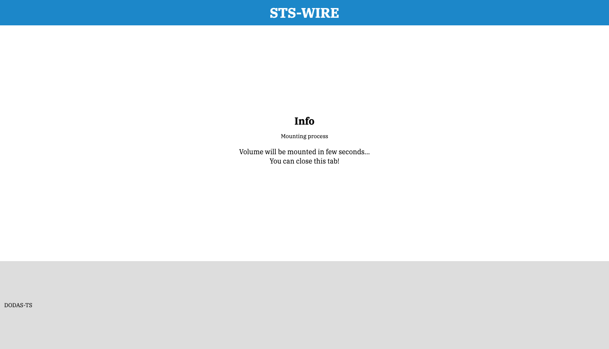

[](https://gitpod.io/#https://github.com/DODAS-TS/sts-wire)

# STS WIRE

### :warning: Attention! :bulb: Tips for new releases

If you are downloading a new release version it is suggested to clean the old configurations. Thus, before use `sts-wire` use the command clean as follows:

```bash
./sts-wire clean
```

## :information_source: Requirements

- fuse installed (Linux and Macos)
  - Linux (Debian or Ubuntu): ` sudo apt install fuse`
    - CentOS or similar: ` sudo dnf install fuse`
  - MacOS: `brew install --cask osxfuse`
    - or use the binary from the [osxfuse website](https://osxfuse.github.io/)
  - Windows:
    - [Use Linux with WSL](https://ubuntu.com/wsl)
    - Other needed program: **winfsp**
      -  [repo](https://github.com/billziss-gh/winfsp)
      -  [webpage](http://www.secfs.net/winfsp/rel/)
  - Further information on fuse dependency with rclone: [rclone mount](https://rclone.org/commands/rclone_mount/)

## :fast_forward: Quick start

Download the binary from the latest release on [github](https://github.com/DODAS-TS/sts-wire/releases) and use it from the command line.
### Linux

```bash
wget https://github.com/DODAS-TS/sts-wire/releases/download/v1.2.2/sts-wire_linux
chmod +x sts-wire_linux
mv sts-wire_linux /usr/local/bin/sts-wire
```
### MacOS

```bash
wget https://github.com/DODAS-TS/sts-wire/releases/download/v1.2.2/sts-wire_osx
chmod +x sts-wire_osx
mv sts-wire_osx /usr/local/bin/sts-wire
```

### Windows

Download the binary with the browser and rename it `sts-wire`: [https://github.com/DODAS-TS/sts-wire/releases/download/v1.2.2/sts-wire_windows.exe](https://github.com/DODAS-TS/sts-wire/releases/download/v1.2.2/sts-wire_windows.exe)

**Note:** it is suggested to use the [Windows Terminal](https://www.microsoft.com/en-us/p/windows-terminal/9n0dx20hk701?activetab=pivot:overviewtab)

### :warning: Check your version :warning:

If you were using a beta version, previously of the first release 1.0.0, you need to delete the old configuration instance files to correctly use the program, because they are incompatible with the further versions. If the latest instance name was `myinstance` for example, you can delete the folder with the command `rm -r .myinstance`.

> **Note:** the instance folder is hidden and that's because it starts with the dot (`.`) character. On windows, that folder is normally visible.

### :point_down: Further information

- [Go to How to use](#question-How-to-use)
- [Go to Launch the program](#rocket-Launch-the-program)

## :hammer: Building from source

To compile from the sources you need a [Go](https://golang.org/dl/) version that supports `Go modules` (e.g. `>= v1.12`). You can compile the executable using the `Makefile`:

```bash
# Linux
make build-linux
# Windows
make build-windows
# MacOS
make build-macos
```

## :question: How to use

You can see how to use the program asking for help in the command line:

```bash
# Linux example
./sts-wire -h
```

The result of the above command will be something similar to this:

```text
Usage:
  sts-wire <IAM server> <instance name> <s3 endpoint> <rclone remote path> <local mount point> [flags]
  sts-wire [command]

Available Commands:
  clean       Clean sts-wire stuff
  help        Help about any command
  report      search and open sts-wire reports
  version     Print the version number of sts-wire

Flags:
      --config string             config file (default "./config.json")
      --debug                     start the program in debug mode
  -h, --help                      help for sts-wire
      --insecureConn              check the http connection certificate
      --log string                where the log has to write, a file path or stderr (default "your/app/config/dir/log/sts-wire.log")
      --noModtime                 mount with noModtime option
      --noPassword                to not encrypt the data with a password
      --rcloneMountFlags string   overwrite the rclone mount flags
      --readOnly                  mount with read-only option
      --refreshTokenRenew int     time span to renew the refresh token in minutes (default 15)
      --tryRemount                try to remount if there are any rclone errors (up to 10 times)


Use "sts-wire [command] --help" for more information about a command.
```

> **Note**: [supported rclone mount options](https://rclone.org/commands/rclone_mount/#options)

As you can see, to use the `sts-wire` you need the following arguments to be passed:

- `<IAM server>`: the name your IAM server where you can verify your credentials
- `<instance name>`: the name you give to the `sts-wire` instance
- `<s3 endpoint>`: the *s3* server you want to use, also a local one, e.g. `http://localhost:9000`
- `<rclone remote path>`: the remote path that you need to mount locally, relative to the *s3* server, e.g. `/folder/on/my/s3`. It could be any of your buckets, also root `/`.
- `<local mount point>`: the folder where you want to mount the remote source. It could be also relative to the current working folder, e.g. `./my_local_mountpoint`

Alternatively, you can create a YAML configuration file like the following:

```yaml
---
IAM_Server: https://my.iam.server.com
instance_name: test_instance
s3_endpoint: http://localhost:9000
rclone_remote_path: /test
local_mount_point: ./my_local_mountpoint
# Other useful options
IAMAuthURL: http://localhost
IAMAuthURLPort: 3128
log: ./logFile.log
noPassword: false
refreshTokenRenew: 10
insecureConn: false
```
### :rocket: Launch the program

In the following example you can see how the program is launched:

```bash
# Linux example
./sts-wire https://my.iam.server.com myMinio https://myserver.com:9000 / ./mountedVolume
```

Alternatively, you can use a config file name myConfig.yml with the same values as shown in [how to use section](#question-How-to-use)

```bash
./sts-wire --config myConfig.yml
```

After that, you have to follow all the instructions and providing a password for credentials encryption when requested.
Eventually, if everything went well, on your browser you will be prompted with a message like:



The volume will stay mounted untill you exit the running *sts-wire* process with `Ctrl+c`

### :hourglass: Renew with Refresh Token

The following is an example of use when you already have an access token, and you want to renew it with a refresh token:

```bash
ACCESS_TOKEN=your_access_token \
IAM_CLIENT_SECRET=iam_secret \
IAM_SERVER=iam_server \
IAM_CLIENT_ID=iam_client_id \
REFRESH_TOKEN=refresh_token \
./sts-wire ${IAM_SERVER} myMinio https://myserver.com:9000 / ./mountedVolume --log .example.log  --noPassword
```

##  :two_men_holding_hands: Contributing :couple::two_women_holding_hands:

If you want to contribute:

1. create a branch
2. upload your changes
3. create a pull request

Thanks!
